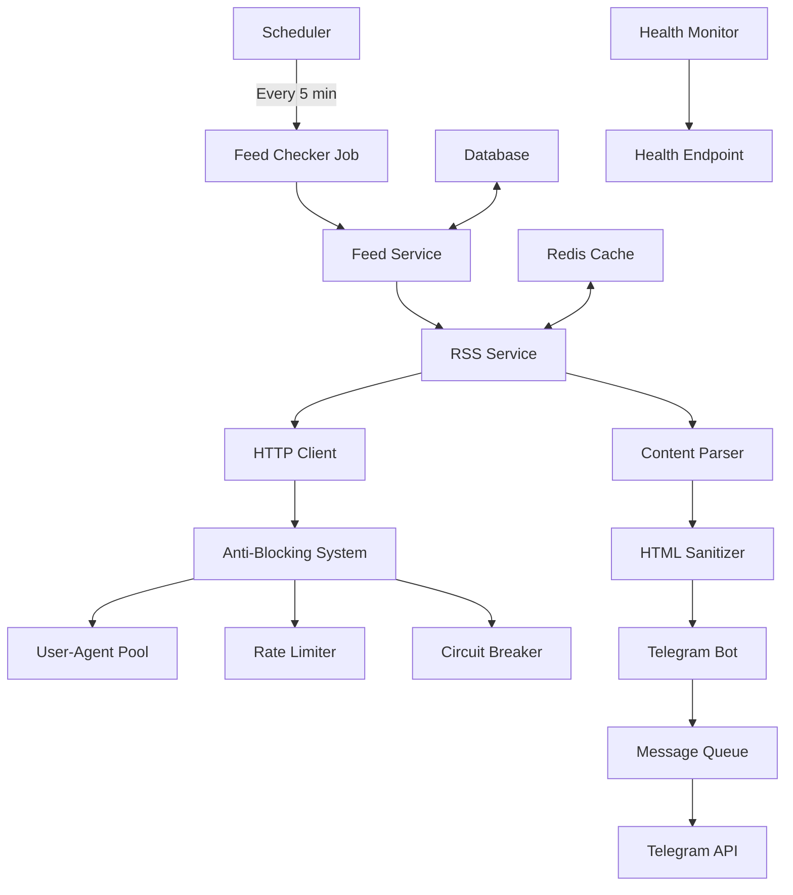
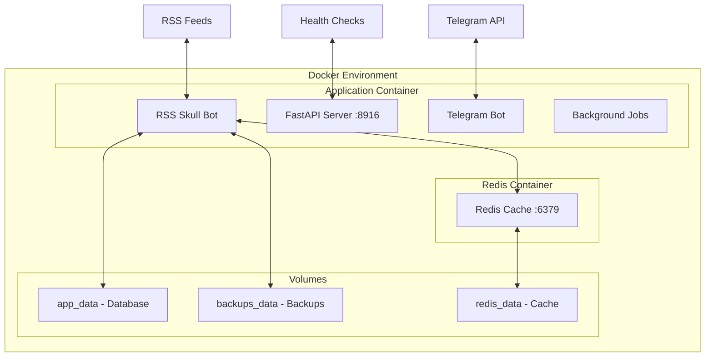

# RSS Skull Bot

<div align="center">
  
</div>

**Enterprise-grade RSS to Telegram Bot with Advanced Anti-Blocking**

A robust, production-ready Telegram bot that monitors RSS feeds and delivers content notifications with enterprise-level reliability. Built with Python using FastAPI and aiogram, featuring comprehensive anti-blocking systems, Reddit integration, circuit breakers, and Docker-first deployment.

## Features

### Core Functionality
- **Multi-format RSS Support**: RSS 2.0, Atom, JSON Feed 1.1 with intelligent parsing
- **Real-time Notifications**: Instant delivery of new feed items to Telegram channels
- **Content Deduplication**: Advanced duplicate detection using intelligent ID matching
- **HTML Sanitization**: Automatic content sanitization for Telegram HTML parse mode
- **Smart Baseline Management**: Prevents notification spam from historical posts

### Anti-Blocking System
- **User-Agent Rotation**: Pool of 10+ realistic browser User-Agents with domain-aware selection
- **Adaptive Rate Limiting**: Dynamic delays that adjust based on server responses (2x on 429, 3x on 403)
- **Circuit Breaker Pattern**: Automatic feed suspension after consecutive failures (5 failures = 1 hour pause)
- **Session Management**: Per-domain HTTP sessions with cookie handling and automatic rotation
- **Request Randomization**: Jitter (±20%) and randomized headers to avoid detection patterns
- **Success Rate Learning**: Tracks and optimizes User-Agent performance per domain

### Reddit Integration
- **Automatic RSS Conversion**: Seamless conversion of Reddit URLs to RSS feeds
- **Fallback Chain**: Multiple access methods (RSS → JSON → old.reddit.com) for blocked subreddits
- **Popularity-based Handling**: Correctly processes Reddit's non-chronological post sorting
- **OAuth API Support**: Optional Reddit API integration with token management

### Reliability & Performance
- **HTTP Caching**: ETag and Last-Modified header support to minimize bandwidth
- **Database Persistence**: SQLite with automatic migrations and data integrity
- **Health Monitoring**: Comprehensive health checks with `/health`, `/metrics`, and `/stats` endpoints
- **Exponential Backoff**: Smart retry mechanisms with configurable delays
- **Memory Management**: Resource monitoring and cleanup to prevent memory leaks

### Telegram Resilience
- **Auto-Recovery**: Automatic recovery from 502 Bad Gateway and API outages
- **Message Queue**: Persistent message queuing during Telegram API downtime (up to 1000 messages)
- **Connection Persistence**: Maintains connection state across restarts
- **Alert System**: Proactive alerts for critical connectivity issues

## Quick Start

### Prerequisites
- Docker and Docker Compose (recommended)
- Python 3.11+ (for local development)
- Telegram Bot Token from [@BotFather](https://t.me/botfather)
- Redis (optional, can be disabled)

### Docker Deployment (Recommended)

1. **Clone the repository**
```bash
git clone https://github.com/runawaydevil/rssskull.git
cd rssskull
```

2. **Configure environment**
```bash
cp .env.example .env
# Edit .env with your BOT_TOKEN and other settings
```

3. **Start the application**
```bash
docker-compose up -d --build
```

4. **Verify deployment**
```bash
# Check container status
docker-compose ps

# View logs
docker-compose logs -f rss-skull-bot

# Check health
curl http://localhost:8916/health
```

### Local Development

1. **Install dependencies**
```bash
pip install -r requirements.txt
```

2. **Configure environment**
```bash
cp .env.example .env
# Edit .env with your configuration
```

3. **Run the application**
```bash
python run.py
```

## Docker Configuration

### Container Architecture

The application runs in a multi-container Docker environment:

- **rss-skull-bot**: Main application container (Python 3.11-slim)
- **redis**: Redis cache container (Alpine Linux)

### Resource Limits

Production-ready resource constraints are configured:

```yaml
# Application Container
Memory: 4GB limit, 1GB reserved
CPU: 1.0 limit, 0.5 reserved

# Redis Container  
Memory: 256MB limit, 128MB reserved
CPU: 0.5 limit, 0.25 reserved
```

### Data Persistence

Three Docker volumes ensure data persistence:

- **`app_data`**: Database storage (`/app/data`)
- **`backups_data`**: Automated backups (`/app/backups`)
- **`redis_data`**: Redis persistence (`/data`)

### Health Checks

Comprehensive health monitoring:

```yaml
# Application Health Check
Interval: 30s
Timeout: 10s
Retries: 10
Start Period: 60s

# Redis Health Check
Interval: 10s
Timeout: 3s
Retries: 3
```

### Container Management

```bash
# Start containers
docker-compose up -d --build

# View logs
docker-compose logs -f rss-skull-bot

# Restart specific service
docker-compose restart rss-skull-bot

# Stop containers (data persists)
docker-compose down

# Clean deployment (WARNING: deletes all data)
docker-compose down -v
docker-compose up -d --build

# Access container shell
docker-compose exec rss-skull-bot sh

# Database backup
docker-compose exec rss-skull-bot python -c "
from app.database import database
database.backup_database()
"
```

### Production Deployment

For production environments:

1. **Configure resource limits** based on your server capacity
2. **Set up log rotation** to prevent disk space issues
3. **Configure monitoring** using the `/health` and `/metrics` endpoints
4. **Set up automated backups** using the backup scripts
5. **Configure reverse proxy** (nginx/traefik) for SSL termination

## Configuration

### Environment Variables

#### Required Configuration
| Variable | Description | Default |
|----------|-------------|---------|
| `BOT_TOKEN` | Telegram bot token from @BotFather | **Required** |

#### Database Configuration
| Variable | Description | Default |
|----------|-------------|---------|
| `DATABASE_URL` | SQLite database path | `file:/app/data/production.db` |

#### Redis Configuration
| Variable | Description | Default |
|----------|-------------|---------|
| `REDIS_HOST` | Redis server hostname | `redis` |
| `REDIS_PORT` | Redis server port | `6379` |
| `REDIS_PASSWORD` | Redis authentication password | `null` |
| `DISABLE_REDIS` | Disable Redis caching entirely | `false` |

#### Server Configuration
| Variable | Description | Default |
|----------|-------------|---------|
| `PORT` | HTTP server port | `8916` |
| `HOST` | HTTP server bind address | `0.0.0.0` |
| `ENVIRONMENT` | Runtime environment | `production` |

#### Logging Configuration
| Variable | Description | Default |
|----------|-------------|---------|
| `LOG_LEVEL` | Logging verbosity level | `info` |

**Log Levels:**
- `debug`: Verbose logging for troubleshooting
- `info`: Standard production logging (recommended)
- `warning`: Warnings and errors only
- `error`: Errors only

#### Access Control
| Variable | Description | Default |
|----------|-------------|---------|
| `ALLOWED_USER_ID` | Restrict bot to specific Telegram user ID | `null` |

#### Anti-Blocking System
| Variable | Description | Default |
|----------|-------------|---------|
| `ANTI_BLOCK_ENABLED` | Enable anti-blocking features | `true` |
| `ANTI_BLOCK_MIN_DELAY` | Minimum delay between requests (seconds) | `5.0` |
| `ANTI_BLOCK_MAX_DELAY` | Maximum delay between requests (seconds) | `300.0` |
| `ANTI_BLOCK_CIRCUIT_BREAKER_THRESHOLD` | Failures before circuit breaker activates | `5` |

#### Reddit Integration
| Variable | Description | Default |
|----------|-------------|---------|
| `USE_REDDIT_API` | Enable Reddit OAuth API | `false` |
| `USE_REDDIT_JSON_FALLBACK` | Enable Reddit JSON fallback | `false` |
| `REDDIT_CLIENT_ID` | Reddit OAuth client ID | `null` |
| `REDDIT_CLIENT_SECRET` | Reddit OAuth client secret | `null` |
| `REDDIT_USERNAME` | Reddit account username | `null` |
| `REDDIT_PASSWORD` | Reddit account password | `null` |

#### Telegram Resilience
| Variable | Description | Default |
|----------|-------------|---------|
| `TELEGRAM_RESILIENCE_ENABLED` | Enable Telegram resilience system | `true` |
| `TELEGRAM_MAX_RETRIES` | Maximum retry attempts | `10` |
| `TELEGRAM_BASE_DELAY` | Base retry delay (milliseconds) | `1000` |
| `TELEGRAM_MAX_DELAY` | Maximum retry delay (milliseconds) | `60000` |
| `MESSAGE_QUEUE_ENABLED` | Enable message queuing | `true` |
| `MESSAGE_QUEUE_MAX_SIZE` | Maximum queued messages | `1000` |

### Configuration Examples

#### Basic Configuration (.env)
```bash
# Required
BOT_TOKEN=your_telegram_bot_token_here

# Optional - Production Settings
LOG_LEVEL=info
ENVIRONMENT=production
ALLOWED_USER_ID=123456789

# Optional - Performance Tuning
ANTI_BLOCK_MIN_DELAY=10.0
REDIS_HOST=redis
DISABLE_REDIS=false
```

#### Development Configuration (.env)
```bash
# Required
BOT_TOKEN=your_telegram_bot_token_here

# Development Settings
LOG_LEVEL=debug
ENVIRONMENT=development
DATABASE_URL=file:./data/development.db

# Disable Redis for local development
DISABLE_REDIS=true
```

## Bot Commands

| Command | Description | Usage |
|---------|-------------|-------|
| `/start` | Initialize bot and show welcome message | `/start` |
| `/help` | Display available commands and usage | `/help` |
| `/add` | Add RSS feed to monitoring | `/add <name> <url>` |
| `/remove` | Remove RSS feed from monitoring | `/remove <name>` |
| `/list` | List all monitored feeds with status | `/list` |
| `/enable` | Enable a disabled feed | `/enable <name>` |
| `/disable` | Temporarily disable a feed | `/disable <name>` |
| `/health` | Check individual feed health status | `/health <name>` |
| `/stats` | Show bot statistics and metrics | `/stats` |
| `/blockstats` | Display anti-blocking system status | `/blockstats` |
| `/ping` | Verify bot connectivity | `/ping` |

### Command Examples

```bash
# Add various feed types
/add TechNews https://example.com/rss
/add RedditPython https://reddit.com/r/Python
/add YouTubeChannel https://youtube.com/@channelname

# Manage feeds
/remove TechNews
/disable RedditPython
/enable RedditPython

# Monitor system
/stats
/blockstats
/health TechNews
```

### Supported Feed Types

- **RSS 2.0**: Standard RSS feeds
- **Atom**: Atom syndication format
- **JSON Feed**: JSON Feed 1.1 specification
- **Reddit**: Automatic conversion to RSS (r/subreddit)
- **YouTube**: Channel and user feeds (requires RSS URL conversion)

## System Architecture

### Application Structure

```
app/
├── main.py                    # FastAPI application with health endpoints
├── bot.py                     # Telegram bot service (aiogram)
├── config.py                  # Configuration management (Pydantic)
├── database.py                # Database initialization and management
├── scheduler.py               # APScheduler job management
│
├── commands/                  # Telegram bot command handlers
│   ├── feed_commands.py      # Feed management commands (/add, /remove, /list)
│   └── __init__.py           # Command registration and setup
│
├── jobs/                      # Background job processors
│   ├── feed_checker.py       # RSS feed monitoring job (5-minute intervals)
│   ├── blocking_monitor.py   # Anti-blocking statistics monitoring
│   └── __init__.py
│
├── services/                  # Core business logic services
│   ├── feed_service.py       # Feed CRUD operations and management
│   ├── rss_service.py        # RSS fetching, parsing, and processing
│   ├── reddit_service.py     # Reddit URL handling and conversion
│   ├── youtube_service.py    # YouTube feed URL conversion
│   ├── reddit_fallback.py   # Reddit fallback chain implementation
│   ├── blocking_stats_service.py  # Anti-blocking statistics tracking
│   └── blocking_alert_service.py  # Blocking alert notifications
│
├── models/                    # Database models (SQLModel)
│   ├── feed.py               # Feed and Chat data models
│   └── __init__.py
│
├── utils/                     # Utility modules and helpers
│   ├── logger.py             # Structured logging with context
│   ├── cache.py              # Redis caching service
│   ├── html_sanitizer.py     # Telegram HTML sanitization
│   ├── user_agents.py        # User-Agent rotation pool
│   ├── header_builder.py     # HTTP header construction
│   ├── rate_limiter.py       # Adaptive rate limiting
│   ├── circuit_breaker.py    # Circuit breaker pattern implementation
│   ├── session_manager.py    # HTTP session management
│   └── __init__.py
│
└── resilience/                # Telegram resilience system
    ├── keep_alive.py         # Connection keep-alive service
    ├── circuit_breaker.py    # Telegram-specific circuit breaker
    ├── retry.py              # Exponential backoff retry logic
    └── __init__.py
```

### Data Flow



### Technology Stack

**Core Framework:**
- **Python 3.11**: Modern Python with async/await support
- **FastAPI**: High-performance web framework for API endpoints
- **aiogram**: Modern Telegram Bot API framework
- **SQLModel**: Type-safe database ORM with Pydantic integration

**Data Storage:**
- **SQLite**: Embedded database with automatic migrations
- **Redis**: Optional caching layer for HTTP responses

**HTTP Client:**
- **aiohttp**: Async HTTP client with session management
- **feedparser**: RSS/Atom feed parsing library

**Job Processing:**
- **APScheduler**: Advanced Python scheduler for background jobs

**Monitoring:**
- **structlog**: Structured logging with context
- **psutil**: System resource monitoring

### Deployment Architecture



## Development

### Local Development Setup

1. **Clone and setup**
```bash
git clone https://github.com/runawaydevil/rssskull.git
cd rssskull
python -m venv venv
source venv/bin/activate  # On Windows: venv\Scripts\activate
pip install -r requirements.txt
```

2. **Configure environment**
```bash
cp .env.example .env
# Edit .env with your BOT_TOKEN and development settings
```

3. **Run locally**
```bash
python run.py
```

### Development Tools

**Code Quality:**
```bash
# Install development dependencies
pip install black ruff mypy

# Format code
black app/

# Lint code
ruff check app/

# Type checking
mypy app/
```

**Testing:**
```bash
# Run tests (when available)
python -m pytest

# Test specific module
python -m pytest tests/test_rss_service.py
```

### Docker Development

**Development with Docker:**
```bash
# Build development image
docker-compose -f docker-compose.yml up --build

# Development with live reload
docker-compose -f docker-compose.dev.yml up

# Run specific services
docker-compose up redis  # Redis only
```

**Database Development:**
```bash
# Access development database
docker-compose exec rss-skull-bot sqlite3 /app/data/production.db

# Reset database (development only)
docker-compose down -v
docker-compose up -d --build
```

### Project Structure Guidelines

**Adding New Features:**
1. Create service in `app/services/`
2. Add models in `app/models/`
3. Create commands in `app/commands/`
4. Add utilities in `app/utils/`
5. Update configuration in `app/config.py`

**Code Style:**
- Follow PEP 8 conventions
- Use type hints for all functions
- Add docstrings for public methods
- Use structured logging with context
- Handle exceptions gracefully

### Contributing

1. **Fork the repository**
2. **Create feature branch**
```bash
git checkout -b feature/amazing-feature
```

3. **Make changes with tests**
4. **Commit with conventional format**
```bash
git commit -m 'feat: add amazing feature'
```

5. **Push and create Pull Request**
```bash
git push origin feature/amazing-feature
```

### Commit Convention

Follow conventional commits specification:

- `feat:` New features
- `fix:` Bug fixes  
- `docs:` Documentation changes
- `style:` Code style changes (formatting, etc.)
- `refactor:` Code refactoring without feature changes
- `test:` Test additions or modifications
- `chore:` Maintenance tasks and dependencies

## Monitoring and Operations

### Health Monitoring

The application provides comprehensive monitoring endpoints:

#### Health Check Endpoint
```bash
GET /health
```

Returns system health status including:
- Database connectivity
- Redis availability (if enabled)
- Telegram bot polling status
- Scheduler status
- Memory usage and uptime

#### Metrics Endpoint
```bash
GET /metrics
```

Provides detailed metrics for monitoring systems:
- Memory usage (RSS, VMS)
- CPU utilization
- Uptime statistics
- Service-specific metrics

#### Statistics Endpoint
```bash
GET /stats
```

Returns operational statistics:
- Feed count and status
- Processing statistics
- Error rates and patterns

### Anti-Blocking Monitoring

Monitor anti-blocking system status:

```bash
# Check blocking statistics via bot
/blockstats

# View current delays and circuit breaker status
# Shows per-domain delays and success rates
```

### Log Management

**Production Logging:**
- Structured JSON logs with context
- Configurable log levels
- Automatic log rotation (when using Docker)
- Health check logs minimized to reduce noise

**Debug Mode:**
```bash
# Enable debug logging
LOG_LEVEL=debug docker-compose restart rss-skull-bot

# View detailed logs
docker-compose logs -f rss-skull-bot
```

### Database Management

**Backup Operations:**
```bash
# Manual backup
docker-compose exec rss-skull-bot python -c "
from app.database import database
database.backup_database()
"

# Automated backups are stored in backups_data volume
docker-compose exec rss-skull-bot ls -la /app/backups/
```

**Database Access:**
```bash
# Access SQLite database directly
docker-compose exec rss-skull-bot sqlite3 /app/data/production.db

# View database schema
.schema

# Query feeds
SELECT * FROM feeds LIMIT 10;
```

### Performance Tuning

**Memory Optimization:**
- Container memory limits prevent OOM kills
- Automatic resource cleanup
- Redis memory management with LRU eviction

**Rate Limiting Tuning:**
```bash
# Adjust anti-blocking delays
ANTI_BLOCK_MIN_DELAY=10.0  # Increase for aggressive rate limiting
ANTI_BLOCK_MAX_DELAY=600.0 # Maximum delay cap

# Circuit breaker sensitivity
ANTI_BLOCK_CIRCUIT_BREAKER_THRESHOLD=3  # Fewer failures before activation
```

### Troubleshooting

#### Common Issues

**Feeds Being Blocked (403 Errors):**
1. Check `/blockstats` for current delays
2. Wait for automatic circuit breaker recovery
3. Increase `ANTI_BLOCK_MIN_DELAY` if needed
4. Monitor success rates per domain

**High Memory Usage:**
1. Check `/metrics` endpoint for memory stats
2. Verify Redis memory limits
3. Review log levels (debug mode uses more memory)
4. Consider reducing feed check frequency

**Telegram API Issues:**
1. Monitor `/health` endpoint
2. Check message queue status
3. Verify bot token validity
4. Review resilience system logs

#### Diagnostic Commands

```bash
# Container resource usage
docker stats rss-skull-bot

# Application logs with timestamps
docker-compose logs -f --timestamps rss-skull-bot

# Redis memory usage
docker-compose exec redis redis-cli info memory

# Database size and statistics
docker-compose exec rss-skull-bot du -sh /app/data/
```

## Contributing

We welcome contributions to RSS Skull Bot. Please follow these guidelines:

### Development Process

1. **Fork the repository** on GitHub
2. **Create a feature branch** from `main`
3. **Make your changes** with appropriate tests
4. **Follow code style** guidelines (Black, Ruff, mypy)
5. **Write clear commit messages** using conventional commits
6. **Submit a Pull Request** with detailed description

### Code Standards

- **Python Style**: Follow PEP 8 conventions
- **Type Hints**: Use type annotations for all functions
- **Documentation**: Add docstrings for public methods
- **Error Handling**: Implement graceful error handling
- **Logging**: Use structured logging with appropriate context

### Testing Guidelines

- Write unit tests for new functionality
- Ensure existing tests pass
- Test Docker deployment locally
- Verify health endpoints work correctly

## License

This project is licensed under the MIT License - see the [LICENSE](LICENSE) file for details.

## Changelog

See [CHANGELOG.md](CHANGELOG.md) for detailed version history and release notes.

## Support

- **Issues**: [GitHub Issues](https://github.com/runawaydevil/rssskull/issues)
- **Discussions**: [GitHub Discussions](https://github.com/runawaydevil/rssskull/discussions)
- **Documentation**: This README and inline code documentation

---

**Developed by [runawaydevil](https://github.com/runawaydevil)**